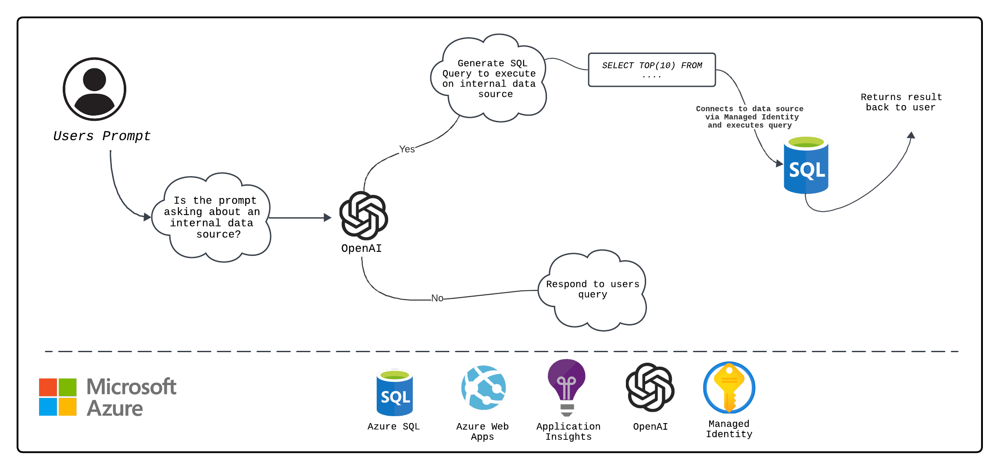

# Text to Query for Azure SQL using OpenAI Function Call

This project creates a backend that can use OpenAI chat models that support the [function calling](https://platform.openai.com/docs/guides/function-calling) ability to answer questions about your Azure SQL Database.
It does this by first identifying if the user query is asking about an internal data source (in this case, it is Azure SQL), if it does, then the application generates a SQL query from the users prompt, connects to the database via user assigned manage identity, executes that query, and relates it back to the user in JSON Format. The flow of this application can be seen using the below diagram.



## Features

This project is designed for deployment via the Azure Developer CLI, hosting the backend on Azure Web Apps, the database being Azure SQL, and the models that support function calling in Azure OpenAI. This demo leverges the ["AdventureWorks"](https://learn.microsoft.com/en-us/sql/samples/adventureworks-install-configure?view=sql-server-ver16&tabs=ssms) Sample Database.

* Conversion of user queries into Azure SQL that can be executed
* Generate results from your internal Azure SQL database based on user queries.
* Enforce only read queries to the database
* Ask questions like "What is the most expensive product we have?", "What is the cost associated with product HL Road Frame - Black, 58" & more!

## Getting Started

### Local Environment

1. Make sure the following tools are installed:

    * [Azure Developer CLI (azd)](https://aka.ms/install-azd)
    * [Python 3.10+](https://www.python.org/downloads/)
    * [Git](https://git-scm.com/downloads)
    * [ODBC Driver 18](https://learn.microsoft.com/en-us/sql/connect/odbc/download-odbc-driver-for-sql-server?view=sql-server-ver16)

2. Clone the repository to your local machine

3. Open the project folder

4. Install required Python packages and backend application:

    ```shell
    pip install -r requirements-dev.txt
    pip install -e app
    ```

5. Continue with the [deployment steps](#deployment) below.

## Deployment

Once you've opened the project in [Codespaces](#github-codespaces), [Dev Containers](#vs-code-dev-containers), or [locally](#local-environment), you can deploy it to Azure.

1. Sign in to your Azure account:

    ```shell
    azd auth login
    ```

    If you have any issues with that command, you may also want to try `azd auth login --use-device-code`.

2. Create a new azd environment:

    ```shell
    azd env new
    ```

    This will create a folder under `.azure/` in your project to store the configuration for this deployment. You may have multiple azd environments if desired.

    You will be asked to select the location of which the resource will be provisioned. You will have the option between 3 options due to model availability.

3. Configure your environment variables that will be used for deployment:

> [!IMPORTANT]
> Please note that SQL Auth cannot be turned off, an admin name and password must be given as part of the database creation process.

 * aad_admin_name: Principal name of the external administrator (UPN). If you need to know what this value is, please login with the Azure CLI and run the script: [fetch-principal-info.sh](./scripts/fetch-principal-info.sh) or [./scripts/fetch-principal-info.ps1](scripts/fetch-principal-info.ps1)

    ```shell
    azd env set AZURE_PRINCIPAL_NAME yourprincipalname
    ```

 * administrator_login: login name of the administrator for the Azure SQL Database.

    ```shell
    azd env set AZURE_ADMIN_LOGIN someadminname
    ```

 * administratorPassword: password of the administrator for the Azure SQL Database. 

    ```shell
    azd env set AZURE_ADMIN_PASSWORD someadminpassword
    ```


## Costs

Pricing may vary per region and usage. Exact costs cannot be estimated.
You may try the [Azure pricing calculator](https://azure.microsoft.com/pricing/calculator/) for the resources below:

* Azure Web Apps: costs are based on the CPU, memory and storage resources you use. You can set the appServiceSkuName parameter in the main.parameters.json file to the sku of your choosing. Additional features like custom domains, SSL certificates and backups may incur additional charges.[Pricing](https://azure.microsoft.com/en-us/pricing/details/app-service/windows/)
* Azure OpenAI: Standard tier, GPT and Ada models. Pricing per 1K tokens used, and at least 1K tokens are used per question. [Pricing](https://azure.microsoft.com/pricing/details/cognitive-services/openai-service/)
* Azure SQL: This project leverage the “General Purpose - Serverless: Gen5, 1 vCore” sku with the adventureworks database. The cost depends on the compute costs and storage costs associated with the project. [Pricing](https://azure.microsoft.com/en-us/pricing/details/azure-sql-database/single/)
* Azure Monitor: Pay-as-you-go tier. Costs based on data ingested. [Pricing](https://azure.microsoft.com/pricing/details/monitor/)

## Security guidelines

This template uses [Managed Identity](https://learn.microsoft.com/entra/identity/managed-identities-azure-resources/overview) for authenticating to the Azure services used (Azure OpenAI, Azure PostgreSQL Flexible Server).

Additionally, we have added a [GitHub Action](https://github.com/microsoft/security-devops-action) that scans the infrastructure-as-code files and generates a report containing any detected issues. To ensure continued best practices in your own repository, we recommend that anyone creating solutions based on our templates ensure that the [Github secret scanning](https://docs.github.com/code-security/secret-scanning/about-secret-scanning) setting is enabled.
